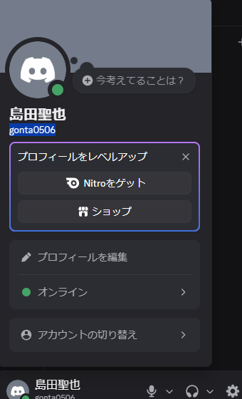

# VPC v1 — 余裕乗り換えナビアプリ

## バリュープロポジションキャンバス

---

## Customer Profile（顧客）

**シーン**: 毎日電車で通学する大学生

| 項目 | ★ 最重要 | その他 |
|---|---|---|
| **Jobs** | ★ 通学2時間を無駄にしたくない | 大学に遅刻せず着く / 疲れずに到着したい |
| **Pains** | ★ 乗り換えダッシュがしんどい・毎回ギリギリ | 電車が混んでスマホも出せない / 2時間立ちっぱなしで消耗する |
| **Gains** | ★ 座って余裕を持って移動できる | 通学中に勉強・作業できる / 大学着いた時点で疲れていない |

---

## Value Map（解決策）

| 項目 | 内容 |
|---|---|
| **Product** | 余裕乗り換えナビアプリ |
| **Pain Relievers** | 乗り換え時間に余裕のあるルートを自動提案 / 「今出れば間に合う」を事前通知 |
| **Gain Creators** | 空いている車両・乗車位置を案内 / 一本早い電車に乗るリマインダー |

---

## Fit 確認

- Pains ★「乗り換えダッシュ」→ Pain Relievers「余裕ルート自動提案」✅
- Gains ★「座って余裕移動」→ Gain Creators「空き車両案内・早起きリマインダー」✅
